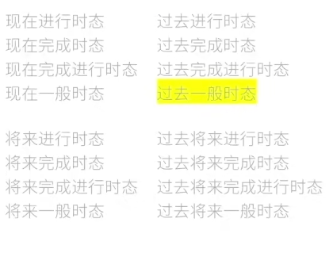
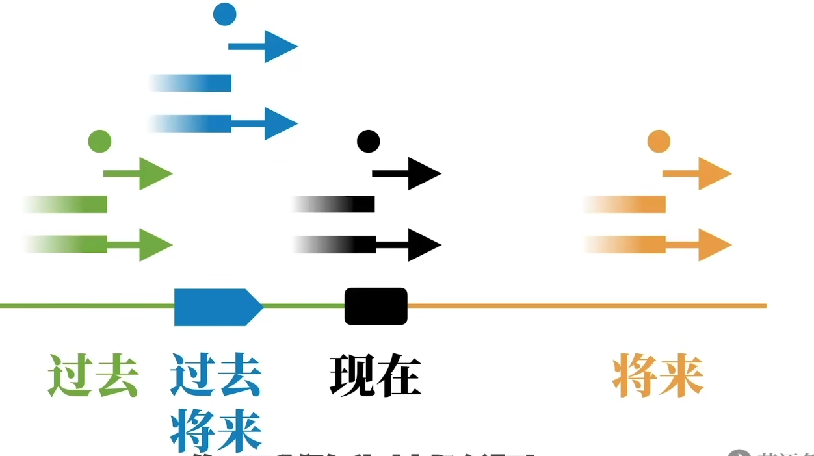
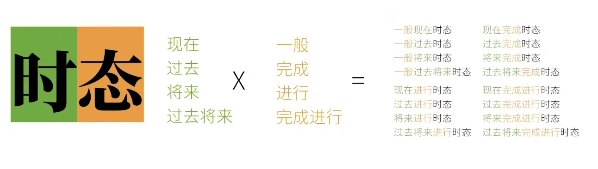

## 主语 Subject

## 谓语动词 Predicate Verb

### 实义动词

1. 按动作承受着划分

- 及物动词
- 不及物动词

2. 按状态动作划分

- 动作动词
- 状态动词
  own v 拥有
  <b>系动词： 可以是不及物动词 也可以是状态动词</b>

助动词

情态动词

## 不及物动词

没有承受者的动词 可以独立完成的动作

## 及物动词

需要有承受者的动词为及物动词

> 一般为 主语 + 及物动词 + 宾语

1. 有一个动作的承受者
   1. 主语 + 单及物动词 + 宾语
2. 有 2 个动作的承受者
   1. 主语 + 双及物动词 + 间接宾语 + 直接宾语
      1. Papa Rabbit teach you english
3. 只有一个动作的承受者的问题（补充）

   1. 主语 + 复杂及物动词 + 宾语 + （宾语）补语
      1. Papa Rabbit considers you smart

4. 非动作（系动词）

   1. Papa Rabbit is tall
   2. Rabbit looks tall

   主语 + 系动词 + (主语)补语/表语

## 助动词

have
be
can
might
must
do

## 时态

1. 动作时间
   1. 现在
   2. 过去
   3. 将来
   4. 过去将来 - 从过去的某个点开始算将来
2. 动作状态
   1. 一般
   2. 完成
   3. 进行
   4. 完成进行

现在有 16 种时态

## 语态

## 语气

## 非谓语动词

1. 动词不定式
2. 现在分词
3. 动名词
4. 过去分词

## 宾语 Object

## 宾语补足语 Object Complement

## 主语补足语 Subject Complement

## 定语 Attributive

主要修饰主语或者宾语的成分

> The little white rabbit are a large corrot

## 状语 Adverbial

修复谓语动词

> Rabbit is quickly

## 同位语 Apposite

## 名词性从句

- 主语从句
- 宾语从句
- 表语从句
- 同位语从句

## 定语从句

## 状语从句

# 词性

时间 和 状态 ===> 时态

## 动词语态:

完成进行状态： 动作的一部分完成了 剩下的部分还在进行中 present progressive tense

完成状态： 动作的状态已经做完了 present perfect tense

进行状态：

 

现在一般状态：

现在进行时：

现在完成时态：present perfect tense 现在完成时态

现在完成进行时态： 现在完成了的状态 但是还会对将来有影响的 present

---

past perfect tense

Past perfect progressive tense

# verbs tense 动词时态

## 一般现在时(并未特别指出的状态)

动词原型 或者 动词原型 + s

1. 表达事实

I eat carrots.

The rabbit eats carrots.

The sun rises in the east.太阳从东边升起.

The earth revolves around the sun. 地球绕太阳转.

You like Papa Rabbit. 你喜欢兔老爹.

2. 表达习惯 重负的动作
3. 表示预计发生的事

## 现在进行时

be的变为 + 现在分词

## 现在完成时态

已经完成的动作 还对现在造成影响

助动词 have的变位 + 动词的过去分词

have： 1. 实义动词 有  2. 助动词 构成时态

过去分词: 通常 + ed

## 现在完成进行时态（对未来还有影响）

have 的变位 + been + 动词过去分词
